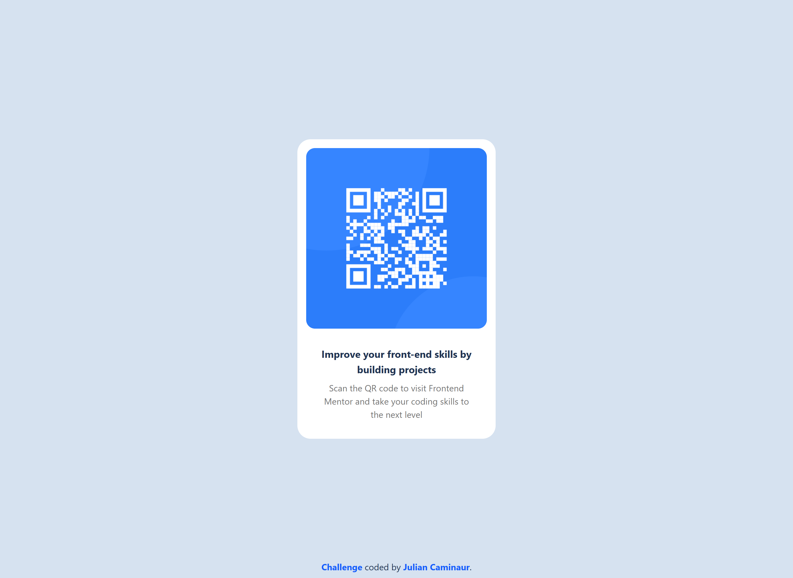
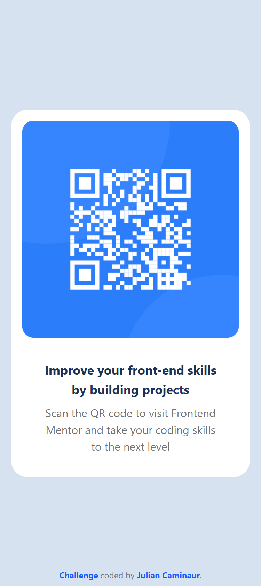

# Frontend Mentor - QR Code Component

This is a solution to the [QR Code Component challenge Frontend Mentor](https://www.frontendmentor.io/challenges/qr-code-component-iux_sIO_H).

## Table of contents

- [Overview](#overview)
  - [The challenge](#the-challenge)
  - [My Solution](#my-solution)
    - [Desktop](#desktop)
    - [Mobile](#mobile)
  - [Links](#links)
- [My process](#my-process)
  - [Built with](#built-with)
  - [Useful resources](#useful-resources)
- [Author](#author)

## Overview

### The challenge

Your challenge is to build out this QR code component and get it looking as close to the design as possible.
You can use any tools you like to help you complete the challenge. So if you've got something you'd like to practice, feel free to give it a go.

Your users should be able to:

- View the optimal layout for the interface depending on their device's screen size
- See hover and focus states for all interactive elements on the page

### My Solution

#### Desktop

#### Mobile

### Links

- Live Site URL: [Live Site](https://caminaur-qr-challenge.netlify.app/)
- Solution Repository: [Github](https://github.com/Caminaur/qr-code-component)

## My process

### Built with

- React JS
- Tailwind

### Useful resources

- [React](https://react.dev/reference/react)
- [Tailwind](https://tailwindcss.com/docs/)

## Author

- [Website](https://julian-caminaur.tech/)
- [Frontend Mentor](https://www.frontendmentor.io/profile/Caminaur)
- [CSS Battle](https://cssbattle.dev/player/caminaur)
- [Exercism](https://exercism.org/profiles/Caminaur)
